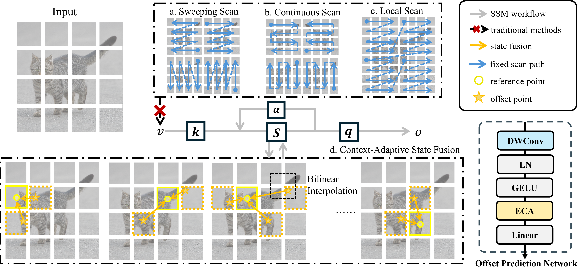

<div align="center">   
  
# Deformba: Vision State Space Model with Adaptive State Fusion
> **Deformba: Vision State Space Model with Adaptive State Fusion**, ICML 2026,
> **[Paper](https://openreview.net/forum?id=4Anq3hEfaO)**
## WorkFlow

</div>

## Abstaract
State Space Models (SSMs) have emerged as a powerful and efficient alternative to Transformers, demonstrating linear-time complexity and exceptional sequence modeling capabilities. However, their application to vision tasks remains challenging. First, existing vision SSMs largely depend on manually designed fixed scanning methods to flatten image patches into sequences, which imposes predefined geometric structures and increases the complexity. Second, the broader adoption of vision SSMs is hindered in domains that require query-based interactions between distinct information streams. This is a result of the inherently causal and self-referential nature of SSMs designed for 1D sequence modeling tasks. This fusion mechanism is indispensable for critical perception tasks such as multi-view 3D fusion. To address these limitations, we propose Deformba, a context adaptive method that dynamically augments the spatial structural information while maintaining the linear complexity of SSMs. Deformba also allows multi-modal fusion, analogous to standard cross attention. To demonstrate the effectiveness and general applicability of Deformba, we test its performance on general 2D vision tasks such as image classification, object detection, instance segmentation, and semantic segmentation, as well as 3D vision tasks like BEV perception. Extensive experiments show that Deformba achieves strong performance across various visual perception benchmark.


## 🛠️ Getting Started

1. Clone repo
   
   ```bash
   git clone https://github.com/amai-gsu/Deformba.git
   cd Deformba
   ```
2. Create and activate a new conda environment
   
   ```bash
   conda create -n Deformba python=3.10
   conda activate Deformba
   ```
3. Install dependent packages
   ```
   pip install --upgrade pip
   pip install -r requirements.txt
   cd models/selective_scan && pip install .
   cd models/ops_dcnv3
   sh ./make.sh
   ```


## 📚 Data Preparation

* ImageNet is an image database organized according to the WordNet hierarchy. Download and extract ImageNet train and val images from http://image-net.org/. Organize the data into the following directory structure:
  
  ```
  imagenet/
  ├── train/
  │   ├── n01440764/  (Example synset ID)
  │   │   ├── image1.JPEG
  │   │   ├── image2.JPEG
  │   │   └── ...
  │   ├── n01443537/  (Another synset ID)
  │   │   └── ...
  │   └── ...
  └── val/
      ├── n01440764/  (Example synset ID)
      │   ├── image1.JPEG
      │   └── ...
      └── ...
  ```
* COCO is a large-scale object detection, segmentation, and captioning dataset. Please visit http://cocodataset.org/ for more information, including for the data, paper, and tutorials. [COCO API](https://github.com/cocodataset/cocoapi) also provides a concise and efficient way to process the data.
* ADE20K is composed of more than 27K images from the SUN and Places databases. Please visit https://ade20k.csail.mit.edu/ for more information and see the [GitHub Repository](https://github.com/CSAILVision/ADE20K) for an overview of how to access and explore ADE20K.

## ✨ Pre-trained Models


<summary> ImageNet-1k Image Classification </summary>
<br>

<div>

|      name       |   pretrain   | resolution | acc@1 | #param | FLOPs |                               download                                |
|:---------------:| :----------: | :--------: |:-----:|:------:|:-----:|:---------------------------------------------------------------------:|
| Deformba-T    | ImageNet-1K  |  224x224   | 83.8  |  25M   | 4.8G  | [ckpt](https://drive.google.com/file/d/1EkRNRcYsdh9gNai5ApiOiAZ7dLXirf39/view?usp=drive_link) |        |
| Deformba-S | ImageNet-1K  |  224x224   | 84.9  |  45M   | 10.3G | [ckpt](https://drive.google.com/file/d/1PIPwdNaFg9ypztxlQU8KFLTBe5lKmOBR/view?usp=sharing) |
| Deformba-B | ImageNet-1K  |  224x224   | 85.4  |  85M   | 16.3G | [ckpt](https://drive.google.com/file/d/1kAaroBPP3JjJ-XRhbjKiB9J3GjJj7dZq/view?usp=sharing) |

</div>

## 🚀 Quick Start

* **Image Classification**
  
  To train Deformba models for classification on ImageNet, use the following commands for different configurations:
  
  ```bash
  cd classification 
  python -m torch.distributed.launch --nnodes=1 --node_rank=0 --nproc_per_node=8 --master_addr="127.0.0.1" --master_port=20000 main.py --cfg </path/to/config> --batch-size 128 --data-path </path/of/dataset> --output /tmp
  ```
  
  To evaluate the performance with pre-trained weights:
  
  ```bash
  cd classification 
  python -m torch.distributed.launch --nnodes=1 --node_rank=0 --nproc_per_node=8 --master_addr="127.0.0.1" --master_port=20000 main.py --cfg </path/to/config> --batch-size 128 --data-path </path/of/dataset> --output /tmp --pretrained </path/of/checkpoint> --eval
  ```
  To test the throughput of model:
  
  ```bash
  cd classification/models 
  python3 benchmark.py --batch-size 128 --model Deformba
  ```

